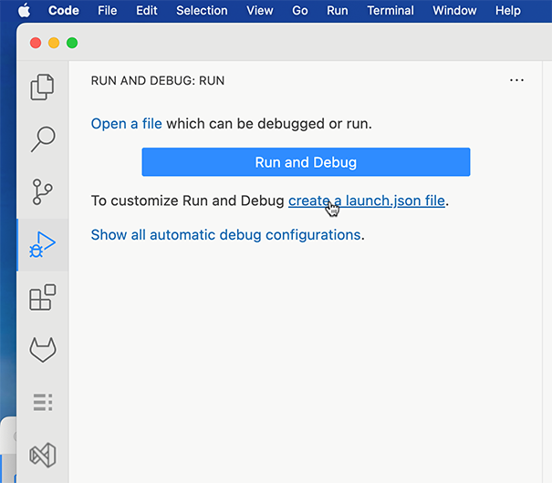
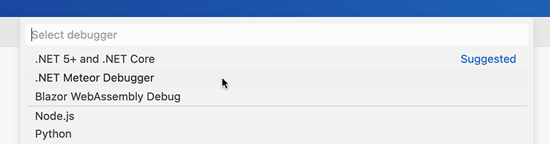
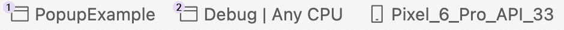
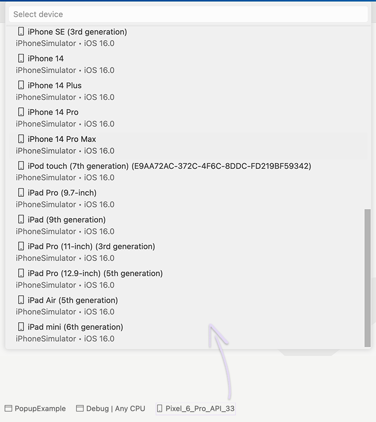

# .NET Meteor

This VSCode extension allows you to build, debug .NET 7 / .NET 6 mobile apps (including MAUI and native C# Android/iOS), and deploy them to Android/iOS devices or emulators.

* Fast and responsive
* Do not require to install the OmniSharp VSCode Extension
* Shows all projects that exist in the opened workspace

# Run the Application

1. Open a project's folder.
1. Open the Run and Debug VSCode tab and click the '_create a launch.json file_'.

    
    
1. In the opened panel, select the '.NET Meteor Debugger'.

    
    
1. In the status bar, select a project (if your opened folder contains several projects) and a configuration (the debug is the default).

    

    
3. In the status bar, click the device name and select a target device/emulator from the opened panel.

    

1. Press F5 to launch the application in the selected configuration (debug, release, etc.). 
1. Enjoy!

## Limitations

* The application's Hot Reload is not available. We are working on implementing this feature.
* XAML IntelliSense is not available.
