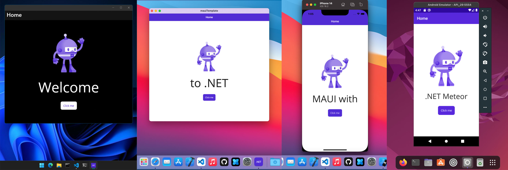

<a href="https://github.com/JaneySprings/DotNet.Meteor/wiki">Documentation</a> | <a href="https://github.com/JaneySprings/DotNet.Meteor/issues">Support</a> | <a href="https://github.com/JaneySprings/DotNet.Meteor/releases">Releases</a>

---

## Overview

&emsp;The .NET Meteor allows you to build, debug `.NET 6` / `.NET 7` apps and deploy them to devices or emulators.

- **Cross-Platform**  
You can use this extension in the `Windows`, `MacOS`, and `Linux` operation systems.

- **XAML IntelliSense**  
The extension provides you with a basic `XAML` syntax highlighting and shows snippets for .NET MAUI / third-party controls (it's necessary to build your project first).

- **MAUI Blazor Support**  
The extension allows you to build and debug `MAUI Blazor` apps (including the `.razor` files).

- **Multiple Folders in a Workspace**  
You can use muliple folders in your workspace and change the current running project.

- **F# support**  
Your can build and debug projects, written in the `F#` language.

---

## Run the Application

1. Open a project's folder.
2. Open the Run and Debug VSCode tab and click the `create a launch.json file`.
3. In the opened panel, select the `.NET Meteor Debugger`.
4. In the status bar, select a project (if your opened folder contains several projects) and a configuration (the debug is the default).
5. In the status bar, click the device name and select a target device/emulator from the opened panel.
6. Press `F5` to debug the application or `ctrl + F5` to launch the application without debugging.
7. Enjoy!

---

## Compatibility

&emsp;The following table lists supported .NET target platforms and their capabilities:

| Application Type | Build and Run | Debugging |
|-|:-:|:-:|
| **WinUI** |✅ | ❌ |
| **Android** | ✅ | ✅ |
| **iOS** | ✅ | ✅ |
| **MacCatalyst** | ✅ | ✅ |

&emsp;*You can debug WinUI apps using the C# VSCode extension with attaching the .NET Core Debugger.*

---

## About the Author

&emsp;I'm Nikita Romanov, a passionate programming enthusiast with a focus on .NET MAUI. I work with an amazing team at `DevExpress` to make the lives of developers around us easier. Our team is dedicated to creating a comprehensive [mobile component suite](https://www.devexpress.com/maui) for .NET MAUI which is currently available `free-of-charge`. In my free time, I work on my hobby project, `DotNet.Meteor`, which is always open to feedback and contributions. Feel free to share your thoughts with me, and **let's make the .NET MAUI community even better together!**
